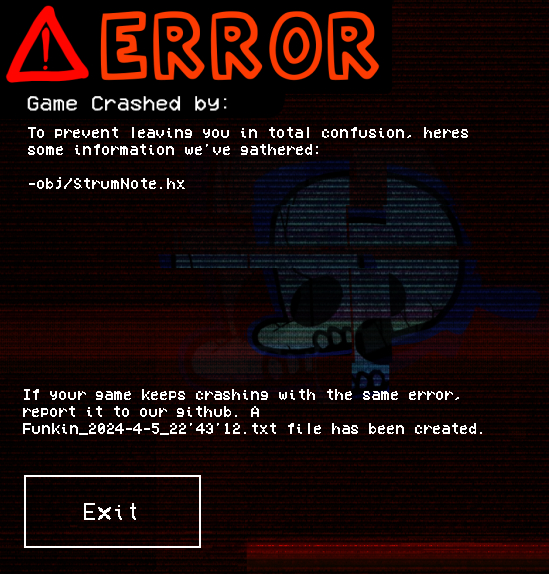

# Crash Handler for flixel/haxeflixel
FlixelCrashHandler is an c# application made in Visual Studio with the [Windows Forms .NET Framework](https://learn.microsoft.com/en-us/dotnet/desktop/winforms/overview/?view=netdesktop-6.0).



## License and usage
This project is licensed under the [MIT license](LICENSE), you are allowed to copy, modify, merge, publish, distribute, sublicense and freely use this resource in your projects, **no credits are required**, but it would be nice to do so :)

## Installation
### NOTE1: THIS CRASH HANDLER WILL ONLY WORK ON WINDOWS BUILDS, ANY OTHER BUILDS WILL BE IGNORED!
### NOTE2: IF U MANUALLY RUN THE EXE IT WONT DO ANYTHING, ITS NOT BECAUSE ITS BROKEN, ITS BECAUSE IT ONLY RUNS WHEN EXECUTED BY ANOTHER PROGRAM!!!
This project was made specificly for Friday Night Funkin', but I decided to also give support to work in any haxeflixel game, in fact, this crash handler will work in every engine/app, you just have to chage the UncaughtErrorEvent depending on your engines programming language and API.


To use this in your projects you must download [the assets and exe]() so you can edit the images and assets to be displayed in the crash handler window, add the ``__engine`` folder to your assets folder and the exe to the same path as your haxeflixel game, in your haxeflixel source code open your ``Main.hx`` and put in these libraries:
```
import openfl.events.UncaughtErrorEvent;
import haxe.CallStack;
import sys.FileSystem;
import sys.io.File;
import openfl.Lib;
import flixel.FlxGame;
```

Under your ``addChild(new FlxGame(...));`` put in ``Lib.current.loaderInfo.uncaughtErrorEvents.addEventListener(UncaughtErrorEvent.UNCAUGHT_ERROR, onCrash);``

and put in the following function:
```
function onCrash(e:UncaughtErrorEvent)
{
  #if desktop
    var callStack:Array<StackItem> = CallStack.exceptionStack(true);
    var daErr = e.error;
    var callStack = callStack;
    var	appName:String = Application.current.meta.get('file')+".exe";
    var parentPath = Sys.programPath().substr(0, Sys.programPath().length-appName.length);
    var cmd = "cd/D "+parentPath+" && FlixelCrashHandler.exe -"+daErr+" -"+parentPath+" -"+appName;
    Sys.command(cmd);
    Sys.exit(-1);
  #end
}
```

## Edditing
If you want to edit the FlixelCrashHandler, download the visual studio solution and modify however you want, but keep in mind, **DO NOT COMPILE IT IN RELEASE MODE, COMPILE IT IN DEBUG MODE** AS IN RELEASE MODE IT WILL THROW AN ERROR FOR SOME REASON!
